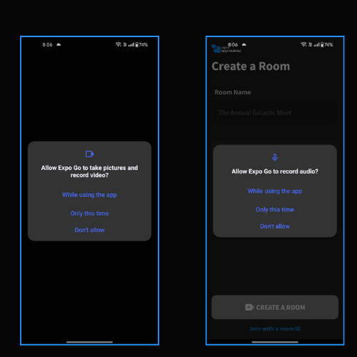
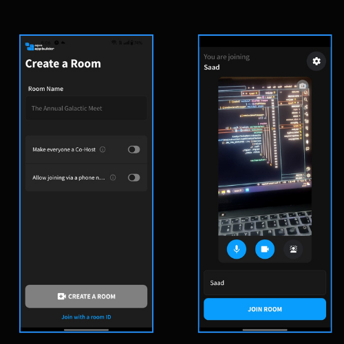
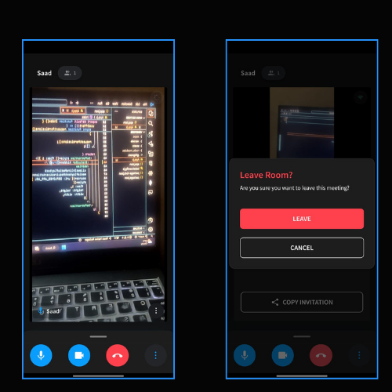

# Agora Sdk Webview
This application integrates the Agora Web SDK via a WebView and handles the necessary permissions to ensure video and audio functionalities work seamlessly and demonstrates how to use `react-native-webview` to display a web application and request camera and audio recording permissions using Expo. The web application in this example is hosted at `https://conferencing.agora.io`, which leverages the Agora SDK for video conferencing.

## Project Overview

### Features

- **WebView Integration**: Displays the Agora web application for video conferencing.
- **Permissions Handling**: Requests camera and audio recording permissions to use the device's hardware for video calls.

## Images

